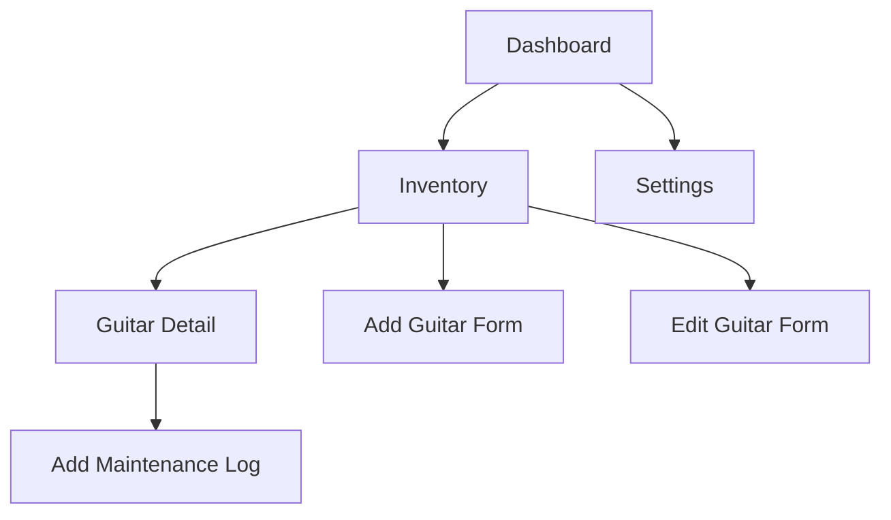

## 1. Product Overview
A web-based dashboard for tracking guitar collection maintenance status. Users can manage their guitar inventory, track string specifications, and maintain a history of maintenance logs with visual status indicators.

The dashboard helps guitar owners stay on top of instrument maintenance by providing clear visual cues about which guitars need attention based on time since last maintenance.

## 2. Core Features

### 2.1 User Roles
This is a single-user application with full access to all features.

### 2.2 Feature Module
The guitar maintenance dashboard consists of the following main pages:
1. **Dashboard**: Overview of all guitars with maintenance status indicators
2. **Inventory**: Full CRUD management of guitar collection
3. **Settings**: Application preferences and configuration

### 2.3 Page Details
| Page Name | Module Name | Feature description |
|-----------|-------------|---------------------|
| Dashboard | Status Overview | Display all guitars with color-coded maintenance status (Red: >6 months, Yellow: 3-6 months, Green: <3 months) |
| Dashboard | Sorting Logic | Automatically sort guitars with urgent (Red) maintenance needs at the top |
| Inventory | Guitar List | View all guitars in collection with basic information |
| Inventory | Add Guitar | Form to add new guitar with maker, model, and string specifications |
| Inventory | Edit Guitar | Update existing guitar information including string specs |
| Inventory | Delete Guitar | Remove guitar from collection with confirmation modal |
| Guitar Detail | Maintenance History | View chronological maintenance log entries |
| Guitar Detail | Add Maintenance Log | Create new maintenance entry with date, type of work, and notes |
| Settings | App Configuration | Manage application preferences and settings |

## 3. Core Process
**Main User Flow:**
1. User lands on Dashboard to see maintenance status overview
2. Click on guitar to view detailed maintenance history
3. Add new maintenance log entries as needed
4. Manage guitar inventory through Inventory page
5. Access Settings for app configuration

## 4. User Interface Design
### 4.1 Design Style
- **Primary Colors**: Deep blue/indigo for primary actions, gray for secondary
- **Status Colors**: Red (urgent), Yellow (warning), Green (good) for maintenance indicators
- **Button Style**: Rounded corners with subtle shadows, consistent with ShadCN design
- **Font**: Clean sans-serif (Inter or similar), 14-16px base size
- **Layout**: Card-based components with consistent spacing
- **Icons**: Lucide-react icons for navigation and actions

### 4.2 Page Design Overview
| Page Name | Module Name | UI Elements |
|-----------|-------------|-------------|
| Dashboard | Status Overview | Grid of guitar cards with status badges, color-coded indicators, last maintenance date |
| Inventory | Guitar List | Table view with guitar details, action buttons (Edit/Delete), add button |
| Guitar Detail | Maintenance History | Chronological list of maintenance entries, add log button at top |
| Add/Edit Forms | Input Fields | Clean form layout with labeled inputs, cancel/save buttons |

### 4.3 Responsiveness
Desktop-first design with responsive sidebar that collapses on mobile devices. Main content area adapts to available space with appropriate breakpoints for tablet and mobile views.