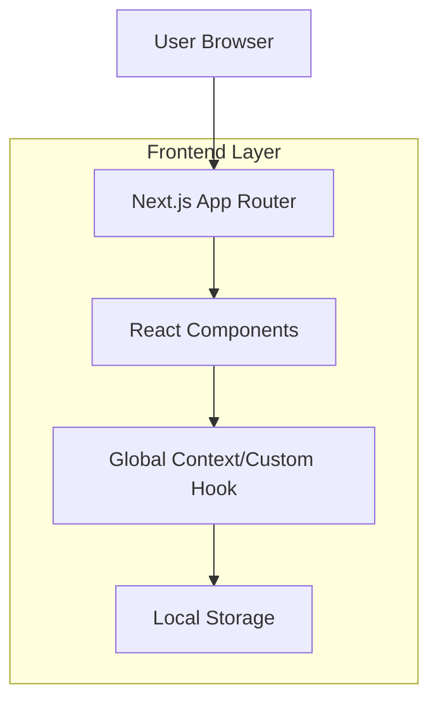
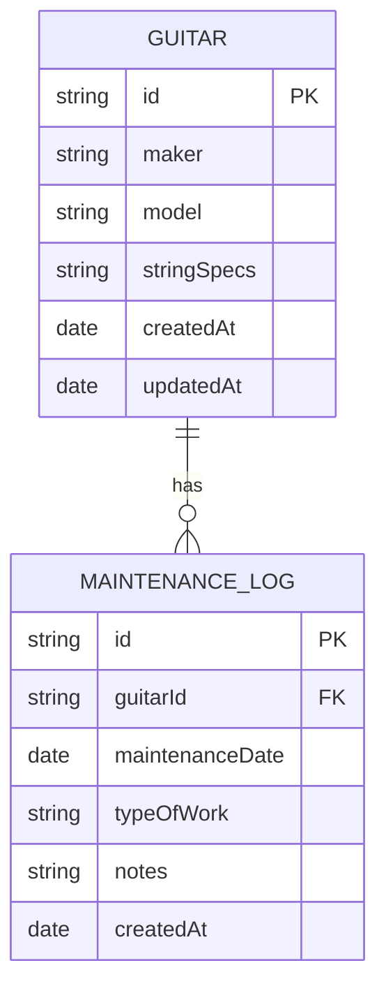

## 1. Architecture design



## 2. Technology Description

* Frontend: Next.js 14 (App Router) + React 18 + Tailwind CSS 3

* Initialization Tool: create-next-app

* Styling: Tailwind CSS with ShadCN UI components

* Icons: lucide-react

* State Management: React Context API / Custom Hooks with localStorage persistence

* Backend: None (client-side only application)

## 3. Route definitions

| Route         | Purpose                                                |
| ------------- | ------------------------------------------------------ |
| /             | Dashboard page, displays maintenance status overview   |
| /inventory    | Inventory management page for guitar CRUD operations   |
| /settings     | Application settings and configuration                 |
| /guitar/\[id] | Individual guitar detail page with maintenance history |

## 4. API definitions

No backend API required - all data management handled client-side through React Context and localStorage.

## 5. Server architecture diagram

Not applicable - this is a client-side only application with no server components.

## 6. Data model

### 6.1 Data model definition



### 6.2 Data Definition Language

Data structures for TypeScript interfaces:

```typescript
interface Guitar {
  id: string;
  maker: string;
  model: string;
  stringSpecs: string;
  createdAt: Date;
  updatedAt: Date;
}

interface MaintenanceLog {
  id: string;
  guitarId: string;
  maintenanceDate: Date;
  typeOfWork: string;
  notes: string;
  createdAt: Date;
}

interface AppState {
  guitars: Guitar[];
  maintenanceLogs: MaintenanceLog[];
}
```

Initial data seed structure:

```javascript
const initialGuitars = [
  {
    id: "1",
    maker: "Fender",
    model: "Strat White",
    stringSpecs: "009-046 Daddario (regular)",
    lastMaintenance: new Date("2025-09-25")
  },
  // ... additional guitars
];

const initialMaintenanceLogs = [
  {
    id: "1",
    guitarId: "1",
    maintenanceDate: new Date("2025-09-25"),
    typeOfWork: "strings",
    notes: "String replacement"
  },
  // ... additional logs
];
```

